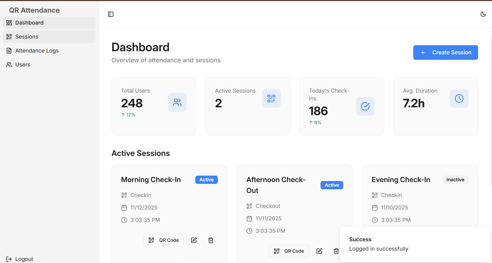
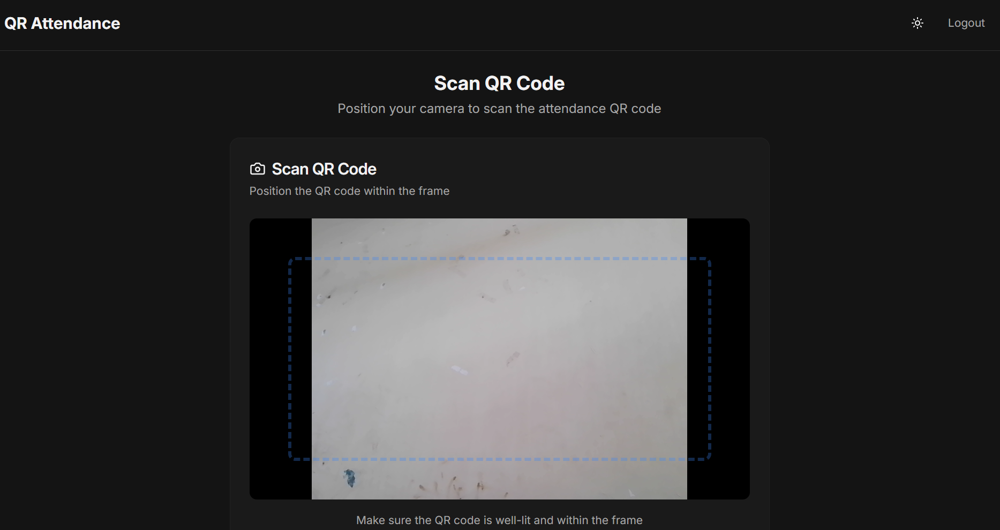

# 📱 QR-Based Attendance System  

A smart and efficient web app that automates attendance tracking using QR codes.  
Built with **React (Frontend)** and **Spring Boot (Backend)** for secure, real-time management.

---

## 🖼️ Project Preview  

  

---

## 📸 Screenshots  

  
  

  

---

## ⚙️ Tech Stack  

**Frontend:** React.js, Tailwind CSS  
**Backend:** Spring Boot (Java 17+)  
**Database:** MongoDB  
**Authentication:** JWT + Spring Security  
**QR Handling:** ZXing / React-QR-Reader  

---

## 🚀 Features  

✅ Unique QR code generation for each user  
✅ QR scan for instant attendance marking  
✅ Secure login for students and admins  
✅ Real-time result display  
✅ Clean, responsive user interface  

---

## 👩‍💻 Author  

**Shivanshu Ranjan**  
🎓 Engineering Student | 💡 Passionate about AI & Web Development  
